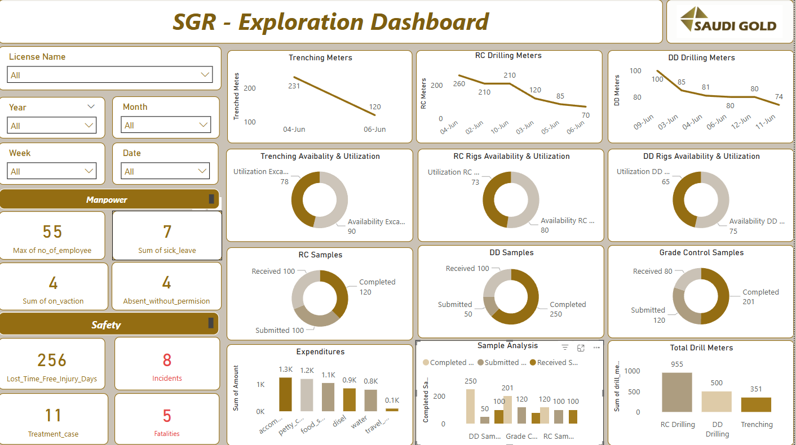

# Data Analyst
# Microsoft Forms + Azure SQL + Power BI Integration

This project demonstrates a complete data pipeline using **Microsoft Forms**, **Azure SQL Database**, and **Power BI** for real-time data visualization.

## 🔧 Tech Stack
- **Microsoft Forms** – Used to collect structured data
- **Azure SQL Database** – Stores form responses in normalized tables
- **Power BI** – Connects to Azure SQL for live dashboard and reporting

---

## 🔗 How It Works

1. **User Submits Form**  
   Microsoft Forms is used to collect operational, safety, and project data from field teams.

2. **Data is Stored in Azure SQL**  
   Each form response is inserted into appropriate tables in a cloud-hosted Azure SQL Database.

3. **Power BI Dashboard**  
   Power BI connects to the Azure SQL database to fetch live data and generate interactive dashboards.

---

## 🗂️ Database Schema

The database contains 9 main tables:
- `safety`
- `manpower`
- `geological_mapping`
- `geophysical_survey`
- `trenching`
- `dd_drilling`
- `rc_drilling`
- `sample_analysis`
- `expenditure`

📁 See [`sql/create-tables.sql`](./sql/create-tables.sql) for full schema.

---

## 🎥 Demo Video

[▶️ Watch on Google Drive](https://drive.google.com/drive/folders/1IflKATg-wUQSB2CdrFSIF4a4-OlDGlj7?usp=drive_link)

## 📸 Screenshots

| Microsoft Form | Power BI Dashboard |
|----------------|--------------------|
|  |  |

---

## ⚠️ Important

> This project was hosted on a **free Azure subscription** which will expire soon.  
> To preserve this setup for future reference, all files, screenshots, and schema are documented here.

---

## 📌 Author

**Maaz** – Data Automation & Integration Enthusiast  
Contact: mohdmaazeesa5360@gmail.com
LinkedIn:linkedin.com/in/mo-maaz-975b33255

# msform-azure-powerbi
Microsoft Forms integrated with Azure SQL and Power BI for real-time data visualization
